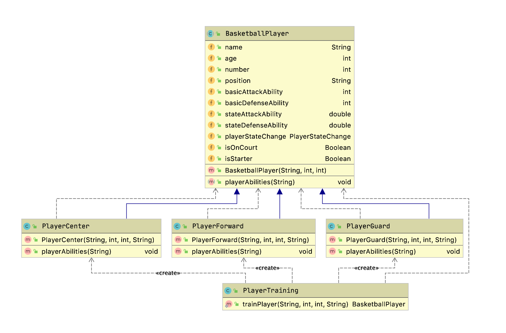
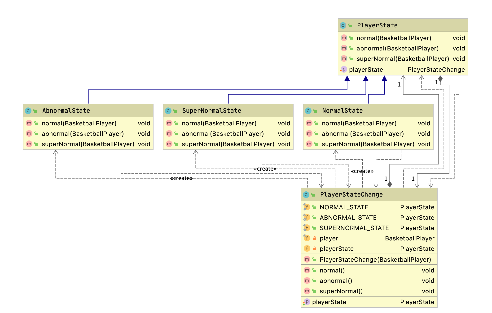
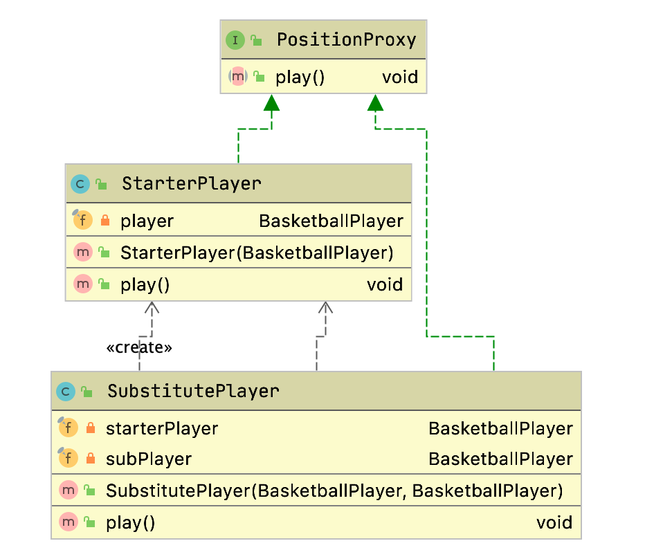
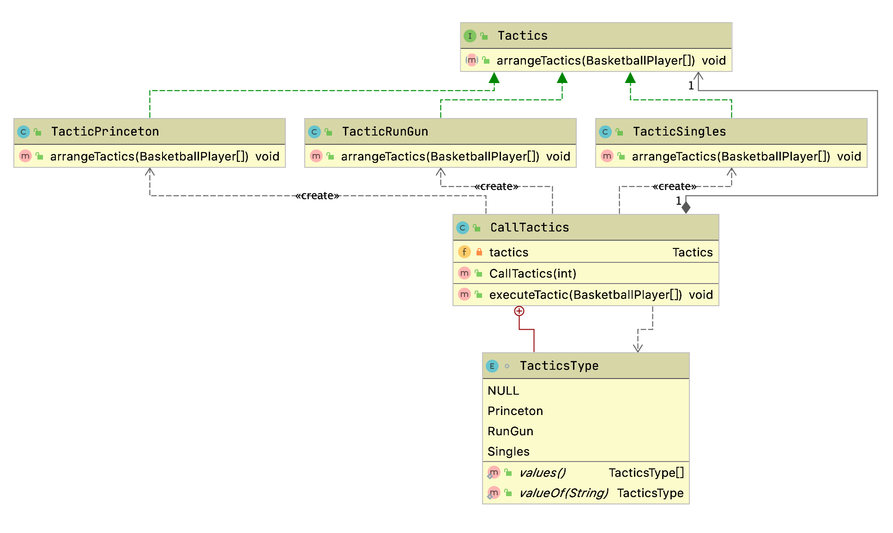

# AnimalsOlympics

## 1 项目背景

该项目为同济大学软件学院2020年软件架构与设计模式的课程设计项目

项目组成员如下：

| 夏哲辉     | 1853996     |
| ---------- | ----------- |
| **谭梓煊** | **1853434** |
| **刘文朔** | **1851008** |
| **董震宇** | **1852143** |
| **肖博阳** | **1852672** |
| **姜昱九** | **1854063** |
| **甘智杰** | **1852563** |
| **陈永顺** | **1854002** |
| **马逸萧** | **1854313** |

设计模式 (Design pattern) 代表了最佳的实践, 通常被有经验的面向对象的软件开发人员所采用。设计模式是软件开发人员在软件开发过程中面临的一般问题的解决方案。这些解决方案是众多软件开发人员经过相当长的一段时间的试验和错误总结出来的。

本项目以动物运动会为背景, 进行软件架构与设计模式的开发, 基于运动项目、运动员等角度用代码复现23种经典设计模式以及其余多种从各种渠道搜集的设计模式。本项目开发小组一共实现了41种设计模式。

| 序号 | 设计模式名字           | 实现个 (套) 数 | Sample个数 | 来源          |
| ---- | ---------------------- | -------------- | ---------- | ------------- |
| 1    | Multiton               | 1              | 1          | 45种设计模式  |
| 2    | Facade                 | 1              | 1          | GoF           |
| 3    | Fly Weight             | 1              | 1          | GoF           |
| 4    | Momento                | 1              | 1          | GoF           |
| 5    | Template               | 1              | 1          | GoF           |
| 6    | Singleton              | 1              | 1          | GoF           |
| 7    | Observer               | 1              | 1          | GoF           |
| 8    | Bridge                 | 1              | 1          | GoF           |
| 9    | Specification          | 1              | 1          | GoF           |
| 10   | Fluent                 | 1              | 1          | PHP 设计模式  |
| 11   | Data Mapper            | 1              | 1          | PHP 设计模式  |
| 12   | Encapsulate Field      | 1              | 1          | 45种设计模式  |
| 13   | Factory                | 1              | 1          | GoF           |
| 14   | Abstract Factory       | 1              | 1          | GoF           |
| 15   | Composite              | 1              | 1          | GoF           |
| 16   | Interpreter            | 1              | 1          | GoF           |
| 17   | Dependency Injection   | 1              | 1          | 45种设计模式  |
| 18   | Chain of Reponsibility | 1              | 1          | GoF           |
| 19   | Visitor                | 1              | 1          | GoF           |
| 20   | Static Factory         | 1              | 1          | GoF           |
| 21   | State                  | 1              | 1          | GoF           |
| 22   | Proxy                  | 1              | 1          | GoF           |
| 23   | Strategy               | 1              | 1          | GoF           |
| 24   | Builder                | 1              | 1          | GoF           |
| 25   | Registry               | 1              | 1          | 45种设计模式  |
| 26   | Null Object            | 1              | 1          | J2EE 设计模式 |
| 27   | Prototype              | 1              | 1          | GoF           |
| 28   | Filter                 | 1              | 1          | GoF           |
| 29   | Iterator               | 1              | 1          | GoF           |
| 30   | Mediator               | 1              | 1          | GoF           |
| 31   | Object Pool            | 1              | 1          | 45种设计模式  |
| 32   | Adapter                | 1              | 1          | GoF           |
| 33   | Decorator              | 1              | 1          | GoF           |
| 34   | Command                | 1              | 1          | GoF           |
| 35   | AOP                    | 1              | 1          | J2EE 设计模式 |
| 36   | Repository             | 1              | 1          | J2EE 设计模式 |
| 37   | Composite Entity       | 1              | 1          | J2EE 设计模式 |
| 38   | Transfer Object        | 1              | 1          | J2EE 设计模式 |
| 39   | MVC                    | 1              | 1          | GoF           |
| 40   | Business Delegate      | 1              | 1          | J2EE 设计模式 |
| 41   | Data Access Object     | 1              | 1          | J2EE 设计模式 |


## 2 设计模式的实现(我的部分)

在本项目中，我使用**静态工厂模式**、**状态模式**、**代理模式**、及**策略模式**设计了一个篮球比赛的情景。

### 2.1 Static Factory/静态工厂模式

静态工厂方法(Static Factory Methods)模式: 又称为简单工厂模式(Simple Factory Pattern), 它属于类创建型模式。在简单工厂模式中, 可以根据参数的不同返回不同类的实例。简单工厂模式专门定义一个类来负责创建其他类的实例, 被创建的实例通常都具有共同的父类。与简单工厂类似, 该模式用于创建一组相关或依赖的对象, 不同之处在于静态工厂模式使用一个静态方法来创建所有类型的对象, 该静态方法通常是 factory 或 build。静态工厂模式不属于GOF23种设计模式, 它更像是一种良好的编程习惯。

#### 2.1.1 应用场景

在动物运动会的篮球比赛中，球员有不同的位置， 如前锋、中锋和后卫。使用静态工厂模式，训练要参赛的小动物们，使他们成为不同角色的球员，进而获得不同的属性。

- 静态工厂类 (Creator): PlayerTraining
- 抽象产品角色 (Product): BasketballPlayer
- 具体产品角色 (Concrete Product): PlayerForward/PlayerCenter/PlayerGuard

#### 2.1.2 API描述

| com.olympic.StaticFactoryClass PlayerTraining |                                                              |
| --------------------------------------------- | ------------------------------------------------------------ |
| Modifier and Type                             | Methods and Description                                      |
| public static BasketballPlayer                | trainPlayer(String name,int age,int number,String playerType)根据playerType确定球员类型, 并返回该球员 |

| pkg.olympic.StaticFactoryAbstract Class BasketballPlayer |                                                          |
| -------------------------------------------------------- | -------------------------------------------------------- |
| Modifier and Type                                        | Methods and Description                                  |
| String                                                   | name球员名字                                             |
| int                                                      | age球员年龄                                              |
| int                                                      | number球员号码                                           |
| protected String                                         | position球员位置                                         |
| protected int                                            | basicAttackAbility球员基础进攻属性                       |
| protected int                                            | basicDefenseAbility球员基础防守属性                      |
| protected PlayerStateChange                              | state球员状态                                            |
| protected boolean                                        | isOnCourt球员是否在场                                    |
| protected boolean                                        | isStarter球员是否首发                                    |
| public                                                   | BasketballPlayer(String name,int age,int number)构造函数 |
| public abstract void                                     | playerAbilities(String position)初始化球员属性           |

| com.olympic.StaticFactoryClass PlayerForward/PlayerCenter/PlayerGuard extends BasketballPlayer |                                                              |
| ------------------------------------------------------------ | ------------------------------------------------------------ |
| Modifier and Type                                            | Methods and Description                                      |
| public                                                       | PlayerForward(String name,int age,int number,String position)构造函数, 设置球员初始状态PlayerCenter/PlayerGuard同理 |
| @Overridepublic void                                         | playerAbilities(String position)根据球员位置, 设置其属性值   |

#### 2.1.3 类图



### 2.2 State/状态模式

状态模式允许一个对象的内在状态改变时改变其行为, 这个对象看起来像是改变了其类, 属于行为模式。状态模式主要解决的是当控制一个对象状态的条件表达式过于复杂时的情况。把状态的判断逻辑转移到表示不同状态的一系列类中, 可以把复杂的判断逻辑简化。

状态模式的优点:

- 封装了转换规则
- 枚举可能的状态, 在枚举状态之前需要确定状态种类
- 将所有与某个状态有关的行为放到一个类中, 并且可以方便地增加新的状态, 只需要改变对象状态即可改变对象的行为
- 允许状态转换逻辑与状态对象合成一体, 而不是某一个巨大的条件语句块
- 可以让多个环境对象共享一个状态对象, 从而减少系统中对象的个数

缺点:

- 状态模式的使用必然会增加系统类和对象的个数
- 状态模式的结构与实现都较为复杂, 如果使用不当将导致程序结构和代码的混乱
- 状态模式对 "开闭原则" 的支持并不太好, 对于可以切换状态的状态模式, 增加新的状态类需要修改那些负责状态转换的源代码, 否则无法切换到新增状态, 而且修改某个状态类的行为也需修改对应类的源代码

状态模式一般包含三个角色:

- Context: 含有状态的对象, 它可以处理一些请求, 这些请求最终产生的响应会与状态相关
- State: 状态接口, 它定义了每一个状态的行为集合, 这些行为会在Context中得以使用。
- ConcreteState: 具体状态, 实现相关行为的具体状态类

#### 2.2.1 应用场景

在动物运动会的篮球比赛中, 每位运动员的状态会随着环境、身体等因素发生改变, 在比赛刚开始时有的动物可能体力充沛, 状态极佳；有的动物可能身体慢热, 状态平平。随着比赛进行, 受到多种因素影响, 有的动物可能状态跌入低估, 也有动物可能手感爆棚……所以通过状态模式设计了三种状态, 正常状态 (Normal) 、失常状态 (abNormal) 和超常状态 (superNormal) 。在比赛中, 每位球员状态随机进行转换。

Context: PlayerStateChange

State: PlayerState

ConcreteState: NormalState/AbnormalState/SuperNormalState

#### 2.2.2 API描述

| com.olympic.StrategyAbstract Class PlayerState |                                                              |
| ---------------------------------------------- | ------------------------------------------------------------ |
| Modifier and Type                              | Methods and Description                                      |
| protected PlayerStateChange                    | playerStateChange指示球员状态的变化                          |
| public void                                    | setPlayerState(PlayerStateChange playerStateChange)供其他类中修改球员状态 |
| public abstract void                           | normal(BasketballPlayer player)子类NormalState中实现, 将球员状态设置为正常状态 |
| public abstract void                           | abnormal(BasketballPlayer player)子类AbnormalState中实现, 将球员状态设置为失常状态 |
| public abstract void                           | superNormal(BasketballPlayer player)子类SuperNormalState中实现, 将球员状态设置为超常状态 |

| com.olympic.StrategyClass PlayerStateChange |                                                              |
| ------------------------------------------- | ------------------------------------------------------------ |
| Modifier and Type                           | Methods and Description                                      |
| public final static PlayerState             | NORMAL_STATE正常状态                                         |
| public final static PlayerState             | ABNORMAL_STATE失常状态                                       |
| public final static PlayerState             | SUPERNORMAL_STATE超常状态                                    |
| private final BasketballPlayer              | player需要更改状态的球员                                     |
| private PlayerState                         | playerState上述球员的状态                                    |
| public                                      | PlayerStateChange(BasketballPlayer player)构造函数, 参数为需要改变状态的球员 |
| public PlayerState                          | getPlayerState()返回球员的状态—playerState                   |
| public void                                 | setPlayerState(PlayerState playerState)将类内球员player的状态设置为传入的参数playerState |
| public void                                 | normal()调用类PlayerState中normal()abnormal()/superNormal()同理 |

| com.olympic.StrategyClass NormalState extends PlayerState |                                                              |
| --------------------------------------------------------- | ------------------------------------------------------------ |
| Modifier and Type                                         | Methods and Description                                      |
| @Overridepublic void                                      | normal(BasketballPlayer player)将球员状态设置为normal, 并且设置对应的属性值 |
| @Overridepublic void                                      | abnormal(BasketballPlayer player)将球员状态由正常状态变为失常状态, 并更改相应属性值 |
| @Overridepublic void                                      | superNormal(BasketballPlayer player)将球员状态由正常状态变为超常状态, 并更改相应属性值 |

| com.olympic.StrategyClass AbnormalState extends PlayerState |                                                              |
| ----------------------------------------------------------- | ------------------------------------------------------------ |
| Modifier and Type                                           | Methods and Description                                      |
| @Overridepublic void                                        | normal(BasketballPlayer player)将球员状态由失常状态变为正常状态, 并更改相应属性值 |
| @Overridepublic void                                        | abnormal(BasketballPlayer player)将球员状态设置为abnormal, 并且设置对应的属性值 |
| @Overridepublic void                                        | superNormal(BasketballPlayer player)将球员状态由失常状态变为超常状态, 并更改相应属性值 |

| com.olympic.StrategyClass SuperNormalState extends PlayerState |                                                              |
| ------------------------------------------------------------ | ------------------------------------------------------------ |
| Modifier and Type                                            | Methods and Description                                      |
| @Overridepublic void                                         | normal(BasketballPlayer player)将球员状态由超常状态变为正常状态, 并更改相应属性值 |
| @Overridepublic void                                         | abnormal(BasketballPlayer player)将球员状态由超常状态变为失常状态, 并更改相应属性值 |
| @Overridepublic void                                         | superNormal(BasketballPlayer player)将球员状态设置为superNormal, 并且设置对应的属性值 |

#### 2.2.3 类图



### 2.3 Proxy/代理模式

在代理模式 (Proxy Pattern) 中, 一个类代表另一个类的功能, 属于结构型模式。代理模式给某一个对象提供一个代理对象, 并由代理对象控制对原对象的引用。通俗的来讲代理模式就是我们生活中常见的中介、律师、经纪人等。代理模式分为三种: 静态代理模式, 动态代理模式和CGLIB代理, 本文中指静态代理模式。

代理模式的优点:

- 职责清晰
- 高扩展性
- 智能化

代理模式的缺点:

由于在客户端和真实主题之间增加了代理对象, 因此有些类型的代理模式可能会造成请求的处理速度变慢。

实现代理模式需要额外的工作, 有些代理模式的实现非常复杂。

代理模式一般包含三个角色:

- 接口: 实现特定功能。
- 实体类: 实现接口类功能的真实对象。
- 代理类: 代替实体类来实现相应功能, 即为代理。

#### 2.3.1 应用场景

在动物运动会篮球比赛中, 球队可以有12名球员, 其中5名首发球员, 7名替补球员。这12名球员司职不同位置, 为了更好地分配球员的体力、更好地执行球队的不同战术或者根据场上情况针对性地使用球员, 采用代理模式, 将篮球运动的位置 (本例中为前文提到的前锋、中锋和后卫) 抽象出来, 首发球员和替补球员都是位置的代理类。便于区分, StarterPlayer可以理解为“在场球员”, 为实体类, 而SubstitutePlayer为在场球员的代理类。

接口: PositionProxy

实体类: StarterPlayer

代理类: SubstitutePlayer

#### 2.3.2 API描述

| com.olympic.ProxyInterface PositionProxy |                              |
| ---------------------------------------- | ---------------------------- |
| Modifier and Type                        | Methods and Description      |
| public void                              | play()提供接口函数, 球员上场 |

| com.olympic.ProxyClass StarterPlayer extends PositionProxy |                                                              |
| ---------------------------------------------------------- | ------------------------------------------------------------ |
| Modifier and Type                                          | Methods and Description                                      |
| private final BasketballPlayer                             | player要上场的球员                                           |
| public                                                     | StarterPlayer(BasketballPlayer player)构造函数, 将球员设置为首发球员 |
| @Overridepublic void                                       | play()具体实现球员上场                                       |

| com.olympic.ProxyClass SubstitutePlayer extends PositionProxy |                                                              |
| ------------------------------------------------------------ | ------------------------------------------------------------ |
| Modifier and Type                                            | Methods and Description                                      |
| private final BasketballPlayer                               | starterPlayer首发球员, 即现在在场的球员                      |
| private final BasketballPlayer                               | subPlayer替补球员, 要替代上面的首发球员登场                  |
| public                                                       | SubstitutePlayer(BasketballPlayer starterPlayer, BasketballPlayer subPlayer)构造函数, 根据传入参数确定要进行替换的两球员 |
| @Overridepublic void                                         | play()具体实现球员上场, 进行球员替换                         |

#### 2.3.3 类图



### 2.4 Strategy/策略模式

在策略模式 (Strategy Pattern) 中, 一个类的行为或其算法可以在运行时更改属于行为型模式。我们创建表示各种策略的对象和一个行为随着策略对象改变而改变的 context 对象。策略对象改变 context 对象的执行算法。策略模式的使用是定义一系列的算法, 把它们一个个封装起来, 并且使它们可相互替换。主要解决了在有多种算法相似的情况下, 使用if…else带来的复杂和难以维护的问题, 使得算法可独立于使用它的客户而变化。

策略模式的优点:

- 算法可以自由切换。
- 避免使用多重条件判断。
- 扩展性良好。

策略模式的缺点:

- 策略类会增多。
- 所有策略类都需要对外暴露。

策略模式一般包含三个角色:

- Context: 用一个ConcreteStrategy对象来配置。维护一个对Strategy对象的引用。可定义一个接口来让Strategy访问它的数据。
- Strategy: 定义所有支持的算法的公共接口。 Context使用这个接口来调用某ConcreteStrategy定义的算法。
- ConcreteStrategy: 以Strategy接口实现某具体算法。

#### 2.4.1 应用场景

在动物运动会篮球比赛中, 每个队伍可以通过暂停来调整他们的战术, 更有针对性的进攻或者防守, 从而赢下比赛。球队的战术是丰富的, 作为示例, 在此次比赛中提供了三种组合战术, 为了更直观的体现, 在展示时做了简化, 战术的改变会影响到球队球员的进攻或防守属性值, 甚至由于球员位置的不同, 影响的程度也不同, 更为直观的体现了策略模式的实现。

- Context: CallTactics
- Strategy: Tactics
- ConcreteStrategy: TacticPrinceton (普林斯顿体系)/TacticRunGun (跑轰)/TacticSingles (持球人单打)

#### 2.4.2 API描述

| com.olympic.StrategyInterface Tactics |                                                              |
| ------------------------------------- | ------------------------------------------------------------ |
| Modifier and Type                     | Methods and Description                                      |
| public void                           | arrangeTactics(BasketballPlayer[] players)接口类, 公共接口函数, 安排战术改变球员属性, 具体方法在子类中实现 |

| com.olympic.StrategyClass TacticPrinceton implements Tactics |                                                              |
| ------------------------------------------------------------ | ------------------------------------------------------------ |
| Modifier and Type                                            | Methods and Description                                      |
| @Overridepublic void                                         | arrangeTactics(BasketballPlayer[] players)执行普林斯顿战术, 队员进攻和防守属性略微提升。 |

| com.olympic.StrategyClass TacticRunGun implements Tactics |                                                              |
| --------------------------------------------------------- | ------------------------------------------------------------ |
| Modifier and Type                                         | Methods and Description                                      |
| @Overridepublic void                                      | arrangeTactics(BasketballPlayer[] players)执行跑轰战术, 队员进攻属性略微提升, 防守属性略微下降。 |

| com.olympic.StrategyClass TacticSingles implements Tactics |                                                              |
| ---------------------------------------------------------- | ------------------------------------------------------------ |
| Modifier and Type                                          | Methods and Description                                      |
| @Overridepublic void                                       | arrangeTactics(BasketballPlayer[] players)执行单打战术, 队内后卫、锋线进攻属性提升, 防守属性下降；中锋进攻属性下降, 防守属性提升 |

| com.olympic.StrategyClass CallTactics |                                                              |
| ------------------------------------- | ------------------------------------------------------------ |
| Modifier and Type                     | Methods and Description                                      |
| private Tactics                       | tactics                                                      |
| enum                                  | TacticsType枚举三种战术及NULL                                |
| public                                | CallTactics构造函数, 根据所选择的战术赋值tactics             |
| public void                           | executeTactics(BasketballPlayer[] players)根据tactics, 对players执行战术, 更改其属性 |

#### 2.4.3 类图



## 3 篮球比赛测试

```
------现在开始测试静态工厂模式, 状态模式, 代理模式, 策略模式------
欢迎进入篮球比赛!组建你的球队<静态工厂模式>，设置首发球员，然后开始游戏！
游戏过程中，可以使用以下按键达到对游戏的控制：
c:更换在场球员 <代理模式>
t:更换球队战术 <策略模式>
s:更改球员状态 <状态模式>
a:恢复游戏(如果没有自动恢复游戏的话，解除以上暂停)
q:退出游戏
Tips:输入1可以进行自动测试，输入2可以手动测试并体验游戏~
1

组建球队测试ing……
James 球员现在处于正常状态！
Harden 球员现在处于正常状态！
Paul 球员现在处于正常状态！
Davis 球员现在处于正常状态！
Yaoming 球员现在处于正常状态！
Curry 球员现在处于正常状态！
Leonard 球员现在处于正常状态！
Towns 球员现在处于正常状态！
组建球队完成！
当前球员信息如下:
```

| Name    | age  | Number | Position | Attack | Defense | ISONCOURT | ISSTART |
| ------- | ---- | ------ | -------- | ------ | ------- | --------- | ------- |
| James   | 36   | 23     | Forward  | 80.0   | 80.0    | false     | false   |
| Harden  | 32   | 13     | Guard    | 100.0  | 60.0    | false     | false   |
| Paul    | 35   | 3      | Guard    | 100.0  | 60.0    | false     | false   |
| Davis   | 26   | 6      | Forward  | 80.0   | 80.0    | false     | false   |
| Yaoming | 39   | 11     | Center   | 60.0   | 100.0   | false     | false   |
| Curry   | 32   | 30     | Guard    | 100.0  | 60.0    | false     | false   |
| Leonard | 29   | 2      | Forward  | 80.0   | 80.0    | false     | false   |
| Towns   | 25   | 32     | Center   | 60.0   | 100.0   | false     | false   |

```
设置首发球员ing……
设置首发球员测试完成！
当前球员信息如下:
```

| Name    | age  | Number | Position | Attack | Defense | ISONCOURT | ISSTART |
| ------- | ---- | ------ | -------- | ------ | ------- | --------- | ------- |
| James   | 36   | 23     | Forward  | 80.0   | 80.0    | true      | true    |
| Harden  | 32   | 13     | Guard    | 100.0  | 60.0    | true      | true    |
| Paul    | 35   | 3      | Guard    | 100.0  | 60.0    | true      | true    |
| Davis   | 26   | 6      | Forward  | 80.0   | 80.0    | true      | true    |
| Yaoming | 39   | 11     | Center   | 60.0   | 100.0   | true      | true    |
| Curry   | 32   | 30     | Guard    | 100.0  | 60.0    | false     | false   |
| Leonard | 29   | 2      | Forward  | 80.0   | 80.0    | false     | false   |
| Towns   | 25   | 32     | Center   | 60.0   | 100.0   | false     | false   |

```
自动测试替换球员ing……
球员登场！Leonard2
替补球员Leonard2替换 James23
球员登场！Curry30
替补球员Curry30替换 Paul3
球员登场！Towns32
替补球员Towns32替换 Yaoming11
自动替换测试完成！现在球员情况:
当前球员信息如下:
```

| Name    | age  | Number | Position | Attack | Defense | ISONCOURT | ISSTART |
| ------- | ---- | ------ | -------- | ------ | ------- | --------- | ------- |
| James   | 36   | 23     | Forward  | 80.0   | 80.0    | false     | true    |
| Harden  | 32   | 13     | Guard    | 100.0  | 60.0    | true      | true    |
| Paul    | 35   | 3      | Guard    | 100.0  | 60.0    | false     | true    |
| Davis   | 26   | 6      | Forward  | 80.0   | 80.0    | true      | true    |
| Yaoming | 39   | 11     | Center   | 60.0   | 100.0   | false     | true    |
| Curry   | 32   | 30     | Guard    | 100.0  | 60.0    | true      | false   |
| Leonard | 29   | 2      | Forward  | 80.0   | 80.0    | true      | false   |
| Towns   | 25   | 32     | Center   | 60.0   | 100.0   | true      | false   |

```
自动使用战术测试ing……
战术使用：进攻-普林斯顿体系，防守-半场紧逼
队内全员进攻、防守属性略微提升！
战术使用成功！

战术使用：进攻-跑轰，防守-32联防
队内全员进攻属性略微提升，防守属性略微下降！
战术使用成功！

战术使用：进攻-单打，防守-包夹持球人
队内后卫、锋线进攻属性提升，防守属性下降；中锋进攻属性下降，防守属性提升！
战术使用成功！

多次战术使用后，球员属性变化:
当前球员信息如下:
```

| Name    | age  | Number | Position | Attack | Defense | ISONCOURT | ISSTART |
| ------- | ---- | ------ | -------- | ------ | ------- | --------- | ------- |
| James   | 36   | 23     | Forward  | 104.0  | 56.0    | false     | true    |
| Harden  | 32   | 13     | Guard    | 130.0  | 42.0    | true      | true    |
| Paul    | 35   | 3      | Guard    | 130.0  | 42.0    | false     | true    |
| Davis   | 26   | 6      | Forward  | 104.0  | 56.0    | true      | true    |
| Yaoming | 39   | 11     | Center   | 63.36  | 150.0   | false     | true    |
| Curry   | 32   | 30     | Guard    | 130.0  | 42.0    | true      | false   |
| Leonard | 29   | 2      | Forward  | 104.0  | 56.0    | true      | false   |
| Towns   | 25   | 32     | Center   | 63.36  | 150.0   | true      | false   |

```
自动测试球员状态更换ing……
Harden 由正常状态变为失常状态：
Harden球员现在处于失常状态！
球员:Harden当前信息如下:
Guard		80.0	48.0	true		true	

Paul 由正常状态变为超常状态：
球员:Paul现在是超常状态！
球员:Paul当前信息如下:
Guard		120.0	72.0	false		true	

Davis 球员现在处于正常状态！
球员:Davis当前信息如下:
Forward		80.0	80.0	true		true	

Harden 由失常状态转化为超常状态：
球员:Harden现在是超常状态！
球员:Harden当前信息如下:
Guard		120.0	72.0	true		true	

球员状态更换测试完成
自动测试：游戏进行中……
自动测试完成！
```


## 4 总结与收获

通过动物运动会项目，我认真的学习了45种设计模式，并且将其中的4种设计到同一个场景下。在这个过程中，除了设计模式本身的收获之外，我对于面向对象语言的类的使用又有进一步的提升。此外，在篮球场景中，需要在比赛在进行过程中实现用户可以叫暂停、更换球员、更换战术等操作，经过查阅资料，利用多线程解决了该问题。这也是第一次使用Java中的多线程。
